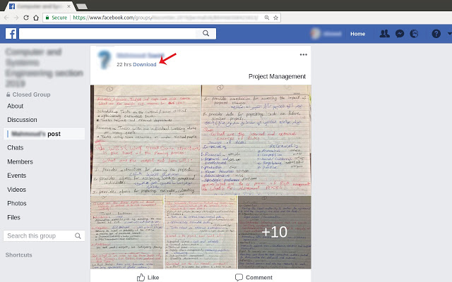
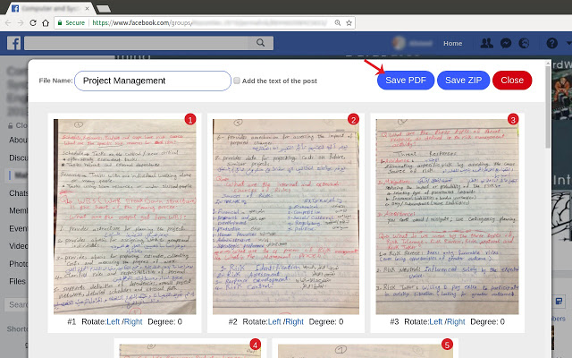

# Save Facebook Post Photos as PDF/ZIP
This is a chrome extension allows you to save the photos of a Facebook post with their high quality as a PDF or a zip file.

## Features:
- Drag and drop to order the photos
- Rotate
- Add the caption and the link of the post
- Save as PDF or ZIP

 
 

##Disclaimer
This extension doesn't violate Facebook terms of use or media rights, it only allows you to download the photos that have "Download" button enabled.
This is not an offical extension and it's not provided by Facebook.

